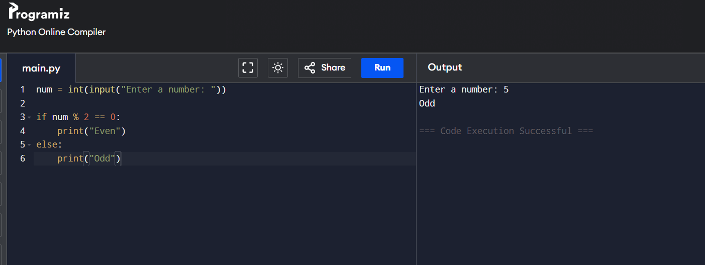

# Conditional Statements in Python: Even or Odd Checker

## 🎯 Aim
To write a Python program to check whether the given number is **even** or **odd** using `if...else` statements.

## 🧠 Algorithm
1. Get an input from the user.
2. Convert the input to an integer and store it in a variable `a`.
3. Use the modulo operator `%` to check if `a % 2 == 0`.
   - If true, print `"EVEN"`.
   - Else, print `"ODD"`.
4. End the program.

## 🧾 Program
```
num = int(input("Enter a number: "))

if num % 2 == 0:
    print("Even")
else:
    print("Odd")
```

## Output


## Result
This python code is verified in online python compiler and the result is attached.
