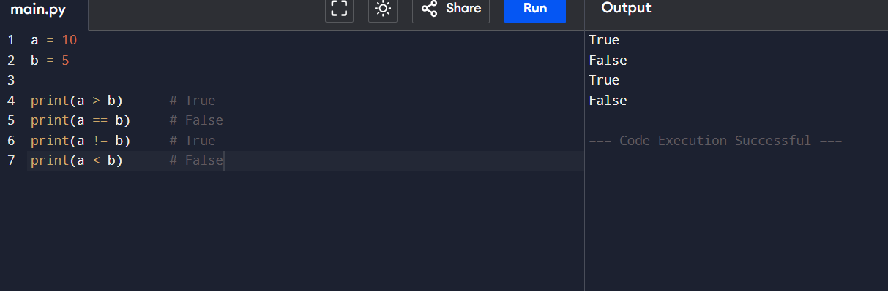

# Ex 1:Datatypes-Boolean Expression Evaluation in Python

## 🎯 Aim
To write a Python program that evaluates and prints the results of boolean and arithmetic expressions involving `True` and `False`.

## 🧠 Algorithm
1. Set variable `a` to the result of the expression `0 == True`.
2. Set variable `b` to the result of the expression `False == False`.
3. Set variable `c` to the result of the expression `True + True`.
4. Set variable `d` to the result of the expression `False + 9`.
5. Print the value of `a` with the label "a is".
6. Print the value of `b` with the label "b is".
7. Print the value of `c` with the label "c:".
8. Print the value of `d` with the label "d:".

## 💻 Program
```
a = 10
b = 5

print(a > b)      
print(a == b)     
print(a != b)     
print(a < b)
```   

## Output

## Result
the output of the code is verified in python compiler and the output is attached.
